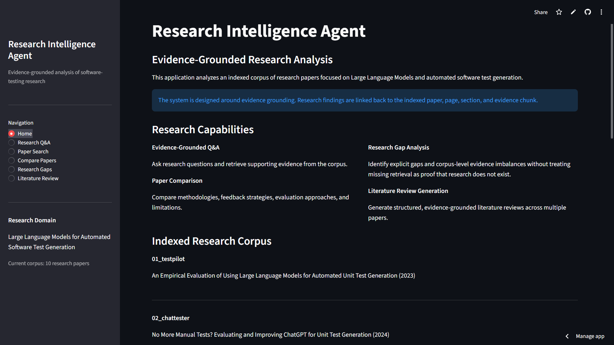
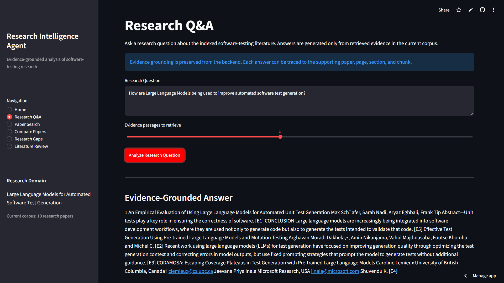

# Research Intelligence Agent

[](https://github.com/jaybaragadi/research-intelligence-agent/actions/workflows/ci.yml)

An evidence-grounded AI research system for analyzing academic literature, retrieving relevant research evidence, comparing methodologies, identifying research gaps, and generating traceable literature reviews.

The project currently focuses on:

> **Large Language Models for Automated Software Test Generation**

It is designed as a research-intelligence pipeline rather than a simple document chatbot. The system preserves paper, page, section, chunk, and citation provenance throughout retrieval and downstream analysis.

[](https://research-intelligence-agent-z6eq5bn8vfnznwmpfgmtw5.streamlit.app/)

🚀 **[Launch the Live Research Intelligence Agent](https://research-intelligence-agent-z6eq5bn8vfnznwmpfgmtw5.streamlit.app/)**

---

## Live Application

The project is deployed on Streamlit Community Cloud and can be explored without installing the repository locally.

**Live Demo:** [Research Intelligence Agent](https://research-intelligence-agent-z6eq5bn8vfnznwmpfgmtw5.streamlit.app/)

### Research Intelligence Dashboard



### Evidence-Grounded Research Q&A

The Q&A workflow retrieves evidence from the indexed research corpus and preserves traceability to the supporting paper, page, section, and evidence chunk.



---

---

## Project Overview

Research Intelligence Agent provides an end-to-end workflow for working with a focused academic research corpus.

The system can:

- ingest academic PDF papers;
- extract page-level text and research metadata;
- create structure-aware research chunks;
- generate local semantic embeddings;
- retrieve research evidence using hybrid semantic and lexical ranking;
- answer research questions with evidence-linked claims;
- compare multiple research papers across defined dimensions;
- identify evidence-backed research-gap signals;
- generate structured literature reviews;
- preserve evidence and citation provenance;
- evaluate retrieval, grounding, comparison, gap analysis, and literature-review quality;
- expose the workflow through a Streamlit interface.

The current implementation uses local retrieval and deterministic evidence-grounded analysis. It does not require a paid LLM API.

---

## Why This Project

Research-oriented RAG systems need to do more than return text that appears relevant.

For research analysis, the system must answer additional questions:

- Which paper supports a claim?
- On which page was the evidence found?
- What section did the evidence come from?
- Can multiple papers be compared without inventing unsupported conclusions?
- Is a claimed research gap explicitly supported by the indexed literature?
- Can a literature review remain traceable back to source evidence?

This project was built around those problems.

The architecture separates:

```text
Retrieval
    ↓
Evidence selection
    ↓
Research analysis
    ↓
Grounded synthesis
    ↓
Validation
    ↓
Citation and provenance
```

This separation allows retrieval weaknesses, grounding quality, comparison coverage, and synthesis behavior to be measured independently.

---

## Current Research Corpus

The current benchmark corpus contains 10 papers covering LLM-assisted and automated software test generation, including work involving:

- direct LLM-based test generation;
- iterative test refinement;
- mutation-guided generation;
- coverage-guided generation;
- symbolic information;
- search-based software testing;
- prompt-guided generation;
- test-quality evaluation;
- limitations and future research directions.

The corpus is intentionally bounded.

Results produced by the system describe the **indexed corpus** and should not be interpreted as exhaustive conclusions about all published research.

---

## Core Capabilities

### Research Q&A

Answers research questions using retrieved evidence and generates claims linked to supporting evidence.

Each evidence item retains provenance including:

- paper ID;
- page number;
- section;
- evidence text;
- citation information.

### Semantic Paper Search

Uses local Sentence Transformer embeddings and FAISS similarity search with lexical signals to retrieve relevant research passages.

### Comparative Research Analysis

Compares selected papers across evidence-backed dimensions such as:

- generation strategy;
- feedback signal;
- iteration strategy;
- quality objective;
- evaluation method;
- limitations.

Unsupported comparison cells are allowed to remain empty rather than forcing a conclusion.

### Research-Gap Analysis

Identifies explicit evidence-backed research limitations, future-work signals, unresolved problems, and corpus-level coverage patterns.

The system deliberately avoids the unsafe inference:

```text
No retrieved evidence
        ≠
Universal research gap
```

### Literature Review Generation

Generates a structured evidence-grounded literature review containing:

1. Introduction
2. Research Landscape
3. Test Generation Strategies
4. Feedback and Iterative Refinement
5. Test Quality and Evaluation
6. Limitations and Research Gaps
7. Future Research Directions
8. Conclusion

Findings remain connected to evidence and citations.

---

## Research Workflow

The system supports a complete research-intelligence workflow over the indexed corpus.

```text
Research Question
      ↓
Semantic + Lexical Retrieval
      ↓
Evidence Selection
      ↓
Grounded Answer
      ↓
Paper Comparison
      ↓
Research-Gap Analysis
      ↓
Literature Review Generation
      ↓
Evidence / Citation Validation
```

Each stage uses structured evidence objects so research outputs can be traced back to the source papers.

### 1. Ask a Research Question

The user begins with a research question such as:

> How do LLM-based test-generation systems use feedback and iteration to improve generated tests?

The system searches the indexed research corpus for relevant passages.

---

### 2. Retrieve Research Evidence

The retrieval layer combines:

- semantic similarity using Sentence Transformer embeddings;
- FAISS vector search;
- lexical relevance signals;
- optional paper filtering.

The output is a ranked set of evidence chunks.

Each result retains:

```text
paper ID
page number
section
chunk ID
retrieval score
evidence text
```

This allows users to inspect exactly where retrieved evidence came from.

---

### 3. Generate an Evidence-Grounded Answer

The grounded Q&A workflow converts retrieved evidence into structured research claims.

Conceptually:

```text
Question
   ↓
Retrieved Evidence
   ↓
Generated Claims
   ↓
Claim → Evidence Mapping
   ↓
Grounding Validation
   ↓
Final Answer
```

Every generated claim must reference existing evidence IDs.

The system validates those references before returning the result.

---

### 4. Compare Research Papers

Users can select multiple papers and compare them across research dimensions such as:

```text
generation strategy
feedback signal
iteration strategy
quality objective
evaluation method
limitations
```

The comparison workflow produces:

- paper-level analytical profiles;
- a comparison matrix;
- evidence-backed comparative findings.

The system does not force unsupported comparisons.

If evidence is unavailable for a dimension, the corresponding comparison cell may remain empty.

---

### 5. Analyze Research Gaps

The gap-analysis workflow searches the selected papers for signals including:

```text
limitations
future work
unresolved problems
underexplored areas
coverage imbalance
```

The system distinguishes among:

```text
explicit research limitations
corpus-level imbalance
insufficient indexed evidence
```

This prevents a common failure mode in research systems:

```text
No evidence retrieved
        ≠
No research exists
```

Gap findings therefore remain scoped to the indexed corpus.

---

### 6. Generate a Literature Review

The literature-review workflow combines:

- comparative analysis;
- gap analysis;
- validated evidence;
- provenance and citations.

The resulting review contains eight structured sections:

```text
1. Introduction
2. Research Landscape
3. Test Generation Strategies
4. Feedback and Iterative Refinement
5. Test Quality and Evaluation
6. Limitations and Research Gaps
7. Future Research Directions
8. Conclusion
```

The review retains evidence references and citation traceability.

---

### 7. Validate Research Outputs

Validation is applied throughout the workflow.

The system checks relationships such as:

```text
claim
  ↓
evidence ID
  ↓
evidence object
  ↓
paper
  ↓
page
```

The same validation pattern is used for:

- comparative findings;
- research-gap candidates;
- literature-review findings.

This makes the research process inspectable rather than opaque.

---

## User-Facing Features

The Streamlit interface exposes the major research workflows directly.

### Research Q&A

Use this page to:

- ask a research question;
- retrieve supporting evidence;
- inspect generated claims;
- review paper and page provenance;
- verify grounding status.

### Paper Search

Use this page to:

- search across the indexed corpus;
- restrict search to selected papers;
- inspect semantic and lexical ranking scores;
- view evidence text with page and section information.

### Compare Papers

Use this page to:

- select two or more papers;
- compare methodologies and findings;
- inspect the comparison matrix;
- review evidence behind each analytical dimension.

### Research Gaps

Use this page to:

- analyze limitations and future-work signals;
- inspect paper-level gap evidence;
- review dimension coverage;
- identify evidence-backed gap candidates.

### Literature Review

Use this page to:

- select a research corpus;
- generate a structured literature review;
- inspect section-level findings;
- review supporting evidence and citations;
- download the generated review as Markdown.

---

## Example Research Journey

A typical workflow might look like this:

```text
Question:
"How do LLM-based test-generation approaches improve test quality?"

        ↓

Paper Search:
Retrieve evidence from MuTAP, CoverUp, ChatUniTest,
TestPilot, and related papers.

        ↓

Grounded Q&A:
Generate evidence-linked claims describing mutation feedback,
coverage feedback, iterative refinement, and quality objectives.

        ↓

Compare Papers:
Compare the selected approaches across generation strategy,
feedback signal, iteration strategy, and evaluation method.

        ↓

Research Gaps:
Identify explicit limitations and future-work signals reported
in the indexed papers.

        ↓

Literature Review:
Synthesize the findings into an eight-section,
citation-traceable review.
```

At every stage, users can inspect the underlying evidence rather than relying only on the final generated prose.

---

## Feature Summary

| Capability | What It Does |
|---|---|
| PDF Ingestion | Extracts page-level text from research papers |
| Metadata Extraction | Identifies abstracts, sections, and research structure |
| Structure-Aware Chunking | Preserves paper, page, section, and chunk provenance |
| Semantic Search | Retrieves related research evidence using local embeddings |
| Hybrid Ranking | Combines semantic similarity with lexical relevance |
| Grounded Q&A | Produces claims linked to supporting evidence |
| Paper Comparison | Compares multiple papers across defined research dimensions |
| Research-Gap Analysis | Detects explicit limitations, future work, and corpus-level patterns |
| Literature Review | Generates an eight-section evidence-grounded research review |
| Citation Provenance | Preserves evidence-to-paper/page traceability |
| Streamlit UI | Provides an interactive research interface |
| Evaluation Framework | Measures retrieval, grounding, comparison, gaps, review, and end-to-end workflow |

---

## Evaluation Results

The system includes a dedicated evaluation framework for retrieval, grounding, comparative analysis, research-gap analysis, literature-review generation, and complete end-to-end workflows.

Evaluation artifacts are stored under:

```text
evaluation/
├── benchmarks/
└── results/
```

The final Phase 13 evaluation report is generated from the saved benchmark result files to keep the documented metrics reproducible.

### Evaluation Summary

| Evaluation Area   | Key Metric                   |  Result |
| ----------------- | ---------------------------- | ------: |
| Retrieval         | Hit@1                        |  40.00% |
| Retrieval         | Hit@5                        |  60.00% |
| Retrieval         | Mean Reciprocal Rank         |  0.5119 |
| Retrieval         | Mean Recall@10               |  82.22% |
| Grounding         | Backend validation pass rate | 100.00% |
| Grounding         | Claim-evidence coverage      | 100.00% |
| Grounding         | Provenance completeness      | 100.00% |
| Grounding         | Expected-paper recall        |  75.56% |
| Comparison        | Structural pass rate         | 100.00% |
| Comparison        | Matrix population rate       |  74.07% |
| Comparison        | Evidence-reference integrity | 100.00% |
| Research Gaps     | Structural pass rate         | 100.00% |
| Research Gaps     | Dimension population rate    |  94.44% |
| Research Gaps     | Evidence-reference integrity | 100.00% |
| Literature Review | Structural pass rate         | 100.00% |
| Literature Review | Finding-evidence coverage    | 100.00% |
| Literature Review | Provenance completeness      | 100.00% |
| End-to-End        | Structural pass rate         | 100.00% |
| End-to-End        | Mean stage success rate      | 100.00% |

---

### Retrieval Evaluation

The retrieval benchmark measures whether expected research papers appear in the ranked retrieval results.

Current baseline:

```text
Hit@1:           40.00%
Hit@3:           40.00%
Hit@5:           60.00%
MRR:              0.5119
Mean Recall@3:   24.44%
Mean Recall@5:   48.89%
Mean Recall@10:  82.22%
```

The most important observation is that retrieval performs considerably better at broader top-k discovery than at early ranking.

This means relevant papers are often found within the top 10 results, but they are not consistently placed among the first few results.

The retriever was intentionally preserved as a baseline rather than tuned directly against these evaluation questions.

#### Cross-Encoder Reranking Experiment

After establishing the frozen retrieval baseline, two cross-encoder reranking strategies were evaluated without modifying the baseline retriever.

| Configuration | Hit@1 | Hit@3 | Hit@5 | MRR | Recall@3 | Recall@5 | Recall@10 |
|---|---:|---:|---:|---:|---:|---:|---:|
| Frozen Baseline | 40% | 40% | 60% | 0.5119 | 24.44% | 48.89% | 82.22% |
| Pure Cross-Encoder | 0% | 60% | 60% | 0.2841 | 31.11% | 42.22% | 88.89% |
| 50/50 Fused Reranker | 40% | 60% | 80% | 0.5289 | 44.44% | 55.56% | 88.89% |

The pure cross-encoder improved some broader-recall metrics but substantially degraded early ranking.

A fixed 50/50 fusion of the frozen baseline score and cross-encoder score produced the strongest aggregate experimental result, including an improvement in Hit@5 from 60% to 80% and Mean Recall@10 from 82.22% to 88.89%.

The fusion weight was intentionally not tuned against the five-question evaluation benchmark to avoid optimizing directly on the test cases.

Because this experiment uses a small benchmark, these results should be interpreted as project-level experimental evidence rather than a general claim about cross-encoder reranking.

---

### Grounding Evaluation

Grounding evaluation verifies whether generated claims remain structurally connected to valid evidence and provenance.

Results:

```text
Backend validation pass rate: 100.00%
Claim-evidence coverage:       100.00%
Provenance completeness:       100.00%
Evidence-reference integrity:  100.00%
Expected-paper recall:          75.56%
```

This distinction is important.

The system achieved complete structural traceability for the evaluated claims, while expected-paper recall remained lower.

That indicates the primary weakness is retrieval coverage rather than loss of evidence provenance after retrieval.

Structural grounding does not independently prove semantic entailment between every claim and supporting passage.

---

### Comparative Analysis Evaluation

The comparative-analysis benchmark evaluates whether requested papers are represented correctly and whether comparison cells and findings retain valid evidence references.

Results:

```text
Structural pass rate:                    100.00%
Mean profile paper coverage:             100.00%
Mean matrix paper coverage:              100.00%
Mean matrix population rate:              74.07%
Cell evidence-reference integrity:       100.00%
Finding evidence-reference integrity:    100.00%
```

A matrix population rate below 100% is acceptable because the system does not force unsupported comparisons.

When evidence for a comparison dimension is unavailable, the corresponding matrix cell can remain empty.

---

### Research-Gap Evaluation

The research-gap benchmark measures whether gap candidates remain evidence-backed and properly scoped to the indexed corpus.

Results:

```text
Structural pass rate:                    100.00%
Mean signal paper coverage:              100.00%
Backend validation pass rate:            100.00%
Candidate evidence-reference integrity:  100.00%
Mean dimension population rate:           94.44%
```

Across the benchmark:

```text
Total gap candidates:                 14
Explicit candidates:                  14
Corpus-imbalance candidates:           0
Insufficient-evidence candidates:      0
```

The absence of every taxonomy category is not treated as a failure.

The system does not manufacture a corpus-imbalance or insufficient-evidence result merely to satisfy category coverage.

---

### Literature-Review Evaluation

The literature-review benchmark evaluates section structure, evidence-backed findings, provenance, citations, and corpus-scope preservation.

Results:

```text
Structural pass rate:                    100.00%
Backend validation pass rate:            100.00%
Mean review paper coverage:              100.00%
Section structure pass rate:             100.00%
Mean finding-evidence coverage:          100.00%
Finding evidence-reference integrity:    100.00%
Mean provenance completeness:            100.00%
Corpus-scope note pass rate:             100.00%
```

Across the three review benchmarks:

```text
Total findings:             17
Total evidence placements: 212
Total citations:           159
```

Evidence placements can be greater than the number of unique evidence items because the same source evidence may legitimately support multiple synthesis sections.

---

### End-to-End Evaluation

The end-to-end benchmark validates complete workflows across:

```text
Grounded Q&A
    ↓
Comparative Analysis
    ↓
Research-Gap Analysis
    ↓
Literature Review
```

Results:

```text
Structural pass rate:                     100.00%
Mean stage success rate:                  100.00%
Answer success rate:                      100.00%
Comparison success rate:                  100.00%
Gap-analysis success rate:                100.00%
Literature-review success rate:           100.00%
Mean comparison paper coverage:           100.00%
Mean gap paper coverage:                  100.00%
Mean literature-review paper coverage:    100.00%
```

Across the benchmark workflows:

```text
Answer claims:            15
Answer evidence items:    24
Comparison findings:      16
Gap candidates:           16
Review findings:          17
Review citations:        160
Shared evidence IDs:     160
```

Shared evidence IDs are treated as a provenance-continuity diagnostic, not an accuracy score.

---

## How to Interpret These Results

The evaluation shows two different characteristics of the system.

### Strongest measured areas

The strongest results are in:

- evidence-reference integrity;
- claim-to-evidence traceability;
- paper and page provenance;
- requested-paper coverage;
- structured analysis validation;
- literature-review structure;
- end-to-end workflow reliability.

### Primary improvement area

The clearest measured weakness is retrieval ranking.

The current retriever reaches:

```text
40.00% Hit@1
60.00% Hit@5
82.22% Mean Recall@10
```

This suggests that candidate discovery is stronger than early ranking.

Future work can therefore focus on improving retrieval ranking without changing the already validated provenance and analysis layers.

---

## Evaluation Boundaries

The evaluation results should not be interpreted as universal model accuracy.

The current benchmarks are intentionally small and corpus-specific:

```text
Retrieval cases:          5
Grounding cases:          5
Comparison cases:         3
Research-gap cases:       3
Literature-review cases:  3
End-to-end cases:         3
```

The benchmarks measure engineering properties such as:

- retrieval ranking;
- evidence coverage;
- reference integrity;
- provenance completeness;
- structural validation;
- workflow completion.

They do not independently establish:

```text
100% semantic correctness
100% scientific correctness
100% research-gap accuracy
human-equivalent peer review
exhaustive literature coverage
```

The results therefore represent a reproducible engineering baseline for the indexed corpus rather than a claim of universal research accuracy.

The complete generated evaluation report is available at:

- `reports/phase13_evaluation_report.md`

---

## Technology Stack

- Python 3.11
- PyPDF
- Sentence Transformers
- FAISS
- NumPy
- Pydantic
- Streamlit
- pytest
- python-dotenv

No paid LLM API is required for the current implementation.

---

## Installation and Setup

### Prerequisites

The project was developed and validated with:

```text
Python 3.11
Git
Windows PowerShell / terminal
```

Python 3.11 is recommended because it is the version used by the validated project environment and automated test suite.

---

### 1. Clone the Repository

```bash
git clone https://github.com/jaybaragadi/research-intelligence-agent.git
cd research-intelligence-agent
```

---

### 2. Create a Virtual Environment

#### Windows

```powershell
py -3.11 -m venv .venv
.venv\Scripts\Activate.ps1
```

Verify:

```powershell
python --version
```

Expected:

```text
Python 3.11.x
```

#### macOS / Linux

```bash
python3.11 -m venv .venv
source .venv/bin/activate
```

---

### 3. Install Dependencies

```bash
python -m pip install --upgrade pip
pip install -r requirements.txt
```

The main dependencies include:

- PyPDF for PDF ingestion;
- Sentence Transformers for local embeddings;
- FAISS for vector similarity search;
- NumPy for numerical operations;
- Pydantic for structured models and configuration;
- Streamlit for the UI;
- pytest for automated testing.

The current implementation does not require a paid LLM API.

---

### 4. Environment Configuration

Copy the example environment file.

#### Windows

```powershell
Copy-Item .env.example .env
```

#### macOS / Linux

```bash
cp .env.example .env
```

Review `.env.example` before changing any values.

Do not commit secrets or machine-specific credentials to the repository.

---

## Research Corpus

Research PDFs are intentionally not committed to the repository.

Place legally obtained PDF files under:

```text
data/papers/
```

The current project was developed and evaluated against a bounded 10-paper corpus focused on LLM-assisted automated software test generation.

Because the source PDFs are not distributed with the repository, benchmark results describe the development corpus used for this project and may not be exactly reproducible with a different set or version of papers.

---

## Running the Application

Start the Streamlit application from the repository root:

```bash
streamlit run app.py
```

Streamlit will print a local URL, typically similar to:

```text
http://localhost:8501
```

Open that address in a browser if it does not open automatically.

The application provides:

```text
Home
Research Q&A
Paper Search
Compare Papers
Research Gaps
Literature Review
```

---

## Using the Application

### Research Q&A

Open **Research Q&A** and enter a research question.

Example:

```text
How are Large Language Models being used to improve
automated software test generation?
```

The page displays:

- the grounded answer;
- generated claims;
- supporting evidence;
- paper and page provenance;
- grounding-validation information.

---

### Paper Search

Open **Paper Search** to retrieve evidence directly from the indexed corpus.

You can:

- enter a search query;
- optionally restrict retrieval to selected papers;
- choose the number of results;
- limit results per paper;
- inspect semantic and lexical ranking information;
- inspect paper, page, section, and chunk provenance.

---

### Compare Papers

Open **Compare Papers** and select at least two papers.

The system analyzes the selected papers across research dimensions such as:

```text
generation strategy
feedback signal
iteration strategy
quality objective
evaluation method
limitations
```

The result includes paper profiles, a comparison matrix, comparative findings, and supporting evidence references.

---

### Research Gaps

Open **Research Gaps** and select the papers to analyze.

The workflow examines:

- explicit limitations;
- future-work signals;
- unresolved problems;
- underexplored areas;
- dimension coverage.

Gap findings are scoped to the indexed corpus.

The system does not interpret missing retrieved evidence as proof that no research exists.

---

### Literature Review

Open **Literature Review**, select at least two papers, provide a research question, and generate the review.

The system produces the structured eight-section review while retaining evidence and citation provenance.

The generated review can also be downloaded as Markdown from the UI.

---

## Running Automated Tests

Run the complete regression suite from the repository root:

```bash
pytest
```

The Phase 14 baseline is:

```text
375 passed
```

This number represents the validated development snapshot and may increase as the project evolves.

To run a specific test module:

```bash
pytest tests/test_retrieval_evaluation.py -v
```

---

## Running Evaluation Benchmarks

The project includes reproducible evaluation runners for the major research workflows.

### Retrieval

```bash
python -m scripts.evaluate_retrieval
```

### Grounding

```bash
python -m scripts.evaluate_grounding
```

### Comparative Analysis

```bash
python -m scripts.evaluate_comparison
```

### Research-Gap Analysis

```bash
python -m scripts.evaluate_gaps
```

### Literature Review

```bash
python -m scripts.evaluate_literature_review
```

### End-to-End Workflow

```bash
python -m scripts.evaluate_end_to_end
```

Evaluation results are written under:

```text
evaluation/results/
```

Benchmark definitions are stored under:

```text
evaluation/benchmarks/
```

---

## Generate the Consolidated Evaluation Report

After evaluation result files are available, generate the Phase 13 report with:

```bash
python -m scripts.generate_evaluation_report
```

The generator writes:

```text
reports/phase13_evaluation_report.md
```

Note that generated report artifacts may be excluded by the repository's `.gitignore` configuration.

---

## Recommended Validation Sequence

For a fully configured development environment, the recommended validation sequence is:

```text
1. Activate Python 3.11 virtual environment
2. Install requirements
3. Configure .env
4. Provide the research PDFs
5. Confirm required processed/index artifacts are available
6. Launch the Streamlit application
7. Run the automated tests
8. Run evaluation benchmarks when validating evaluation behavior
```

The source corpus, processed artifacts, and vector index are separate from the application source code so that local research data does not need to be committed to Git.

---

## Repository Structure

The repository is organized by responsibility so ingestion, retrieval, research analysis, presentation, and evaluation remain separate.

```text
research-intelligence-agent/
│
├── app.py
├── README.md
├── ARCHITECTURE.md
├── requirements.txt
├── .env.example
│
├── data/
│   ├── papers/
│   ├── processed/
│   └── vector_store/
│
├── evaluation/
│   ├── benchmarks/
│   └── results/
│
├── reports/
│
├── scripts/
│   ├── evaluate_retrieval.py
│   ├── evaluate_grounding.py
│   ├── evaluate_comparison.py
│   ├── evaluate_gaps.py
│   ├── evaluate_literature_review.py
│   ├── evaluate_end_to_end.py
│   └── generate_evaluation_report.py
│
├── src/
│   ├── ingestion/
│   ├── retrieval/
│   ├── tools/
│   ├── agents/
│   ├── generation/
│   ├── analysis/
│   ├── evaluation/
│   └── ui/
│
└── tests/
```

> Some local research-data and generated-artifact directories may be excluded from Git. See `.gitignore` for the repository's current tracking policy.

---

## Codebase Guide

### `src/ingestion/` — Research Paper Processing

Responsible for converting source research papers into structured text that downstream components can use.

This layer includes responsibilities such as:

```text
PDF loading
page-level extraction
text cleaning
section parsing
abstract extraction
research-signal extraction
structure-aware chunk construction
```

A major design requirement is preservation of source provenance during processing.

---

### `src/retrieval/` — Semantic Retrieval

Responsible for indexing and retrieving research evidence.

The retrieval layer contains the functionality supporting:

```text
local embeddings
FAISS vector storage
semantic similarity
lexical relevance
hybrid ranking
paper filtering
ranked evidence retrieval
```

This layer answers:

> Which indexed passages are most relevant to the research query?

It does not independently decide what research conclusion should be drawn from those passages.

---

### `src/tools/` — Reusable Research Operations

Contains reusable research capabilities consumed by higher-level workflows.

Examples include:

```text
paper search
paper summarization
paper comparison
evidence retrieval
citation generation
```

Keeping these operations separate allows multiple workflows to reuse the same corpus capabilities.

---

### `src/agents/` — Research Orchestration

Contains the deterministic research-agent and intent-routing layer.

Conceptually:

```text
User request
     ↓
Intent classification
     ↓
Research orchestration
     ↓
Appropriate tool / service
```

The current implementation does not require an external agent-orchestration framework.

---

### `src/generation/` — Evidence-Grounded Q&A

Contains the evidence-grounded answer pipeline.

The primary service is:

```python
GroundedAnswerService
```

The generation layer manages relationships among:

```text
research question
retrieved evidence
generated claims
claim → evidence mappings
grounding validation
final grounded answer
```

A generated claim retains references to its supporting evidence rather than returning unsupported prose.

---

### `src/analysis/` — Research Intelligence

Contains the higher-level cross-paper research-analysis workflows.

Major capabilities include:

```text
Comparative Research Analysis
Research-Gap Analysis
Literature-Review Generation
```

Primary services include:

```python
ComparativeAnalysisService
ResearchGapAnalysisService
LiteratureReviewService
```

These workflows operate on structured evidence and produce structured intermediate results before presentation.

---

### `src/evaluation/` — Evaluation Framework

Contains the Phase 13 benchmark-evaluation implementation.

The evaluation framework measures:

```text
retrieval
grounding
comparison
research-gap analysis
literature-review generation
end-to-end workflow behavior
```

The evaluators call the existing production services rather than implementing separate research logic.

This helps ensure the benchmark evaluates the same code paths used by the application.

---

### `src/ui/` — Streamlit Presentation Layer

Contains the user-facing Streamlit interface.

The UI exposes:

```text
Home
Research Q&A
Paper Search
Compare Papers
Research Gaps
Literature Review
```

The UI is intentionally kept separate from the underlying research logic.

Conceptually:

```text
Streamlit page
      ↓
cached service
      ↓
existing backend service
      ↓
structured result
      ↓
UI rendering
```

This avoids duplicating research logic inside presentation code.

---

## Evaluation Artifacts

### `evaluation/benchmarks/`

Contains the benchmark definitions used during Phase 13.

Current benchmark categories include:

```text
retrieval
grounding
comparison
research gaps
literature review
end-to-end
```

These benchmarks are intentionally bounded and corpus-specific.

They should not be interpreted as universal scientific ground truth.

### `evaluation/results/`

Contains the structured JSON results generated by the evaluation runners.

Keeping benchmark definitions and results separate makes it possible to inspect both:

```text
what was evaluated
        ↓
what the system produced
```

---

## Scripts

The `scripts/` directory contains executable development and evaluation entry points.

Phase 13 evaluation scripts include:

| Script | Purpose |
|---|---|
| `evaluate_retrieval.py` | Evaluates retrieval ranking and expected-paper coverage |
| `evaluate_grounding.py` | Evaluates claim/evidence traceability and provenance |
| `evaluate_comparison.py` | Evaluates comparative-analysis structure and evidence integrity |
| `evaluate_gaps.py` | Evaluates research-gap structure and evidence integrity |
| `evaluate_literature_review.py` | Evaluates literature-review structure and grounding |
| `evaluate_end_to_end.py` | Evaluates complete multi-stage research workflows |
| `generate_evaluation_report.py` | Consolidates saved evaluation results into a report |

Additional scripts may support corpus preparation and development workflows.

---

## Tests

The `tests/` directory contains automated tests across the complete system.

Coverage includes:

```text
configuration
PDF ingestion
text cleaning
metadata extraction
section parsing
chunking
retrieval
FAISS storage
research tools
agent routing
grounding
comparative analysis
research-gap analysis
literature-review generation
Streamlit presentation helpers
evaluation metrics
end-to-end evaluation
```

The current validated regression baseline is:

```text
375 passing tests
```

The test suite is intended to protect both individual components and cross-layer behavior.

---

## How the Main Layers Connect

The codebase can be understood as five major engineering layers:

```text
1. DATA PREPARATION
   ingestion
       ↓
   metadata / structure
       ↓
   chunks

2. RETRIEVAL
   embeddings
       ↓
   FAISS
       ↓
   hybrid ranking

3. RESEARCH INTELLIGENCE
   tools
       ↓
   orchestration
       ↓
   grounded Q&A / comparison / gaps / literature review

4. PRESENTATION
   Streamlit UI

5. QUALITY
   tests
       +
   evaluation benchmarks
       +
   saved evaluation results
```

This separation allows each layer to be tested and evaluated independently while still participating in the complete research workflow.

---

## Where to Start Reading the Code

For someone reviewing the project for the first time, a useful reading order is:

```text
README.md
    ↓
ARCHITECTURE.md
    ↓
app.py
    ↓
src/ui/
    ↓
src/generation/answer_service.py
    ↓
src/analysis/comparative_service.py
    ↓
src/analysis/gap_analysis_service.py
    ↓
src/analysis/literature_review_service.py
    ↓
src/retrieval/
    ↓
src/ingestion/
    ↓
src/evaluation/
    ↓
tests/
```

This starts with the user-facing workflow and then moves progressively toward the lower-level implementation.

---

## Engineering Highlights

This project goes beyond a basic document-question-answering RAG application.

The main engineering focus is building a research-intelligence pipeline where conclusions remain traceable to source evidence.

### Key Engineering Decisions

#### 1. Preserve Provenance from Ingestion to Final Output

Evidence provenance is maintained throughout the pipeline:

```text
PDF
 ↓
Page
 ↓
Section
 ↓
Chunk
 ↓
Retrieved Evidence
 ↓
Research Claim / Finding
 ↓
Citation
```

This makes it possible to trace analytical outputs back to the source paper and page.

---

#### 2. Separate Retrieval from Research Reasoning

Retrieval and research analysis are implemented as separate responsibilities.

```text
Retrieval:
Which passages are relevant?

Analysis:
What can safely be concluded from those passages?
```

This separation also allows retrieval performance and grounding integrity to be evaluated independently.

---

#### 3. Use Structured Intermediate Representations

The system does not immediately convert retrieved passages into unstructured final prose.

Major workflows produce structured objects such as:

```text
GroundedAnswer
ComparativeAnalysis
ResearchGapAnalysis
LiteratureReview
```

These structures make evidence references, findings, validation results, and provenance inspectable and testable.

---

#### 4. Avoid Unsupported Research-Gap Claims

A missing retrieval result is not treated as proof that a research area does not exist.

```text
No retrieved evidence
        ≠
Universal research gap
```

Gap findings are therefore explicitly scoped to the indexed corpus.

---

#### 5. Allow Missing Comparison Evidence

The comparison engine does not force every paper to contain evidence for every analytical dimension.

A comparison cell can remain empty when supporting evidence is unavailable.

This is preferable to generating an unsupported comparison merely to complete a matrix.

---

#### 6. Keep the Current Pipeline Local

The current implementation uses local Sentence Transformer embeddings and FAISS retrieval.

No paid LLM API is required.

The analytical and validation workflows are deterministic, which makes the current benchmark behavior reproducible and easier to test.

---

#### 7. Evaluate Individual Stages and the Complete Workflow

The evaluation framework separately measures:

```text
Retrieval
Grounding
Comparison
Research-Gap Analysis
Literature Review
End-to-End Workflow
```

This makes it possible to identify where weaknesses occur instead of reporting a single overall score.

For example, the current baseline shows stronger top-10 discovery than early retrieval ranking, while downstream structural evidence traceability remains strong.

---

## What Makes This Different from Basic RAG

A basic RAG application often follows:

```text
Documents
    ↓
Chunks
    ↓
Vector Search
    ↓
Prompt
    ↓
Generated Answer
```

This project extends that pattern into a research-analysis architecture:

```text
Research PDFs
      ↓
Structure-Aware Ingestion
      ↓
Hybrid Evidence Retrieval
      ↓
Structured Evidence
      ↓
┌─────────────────────────────────────┐
│ Grounded Q&A                        │
│ Comparative Research Analysis       │
│ Research-Gap Analysis               │
│ Literature-Review Generation        │
└─────────────────────────────────────┘
      ↓
Evidence Validation
      ↓
Citation / Provenance Traceability
      ↓
Evaluation
```

The distinction is important because research analysis requires more than finding semantically similar text.

The system must also preserve:

- which paper supports a finding;
- where the evidence occurs;
- which evidence supports each claim;
- whether a comparison is actually supported;
- whether a claimed gap is justified by the indexed evidence;
- whether citations remain valid through multi-stage synthesis.

---

## Technical Challenges and Design Responses

| Challenge | Design Response |
|---|---|
| Academic PDFs lose structure during extraction | Preserve page provenance and reconstruct research sections before chunking |
| Fixed-size chunks can lose research context | Use structure-aware chunking with section metadata |
| Semantic similarity alone may not rank the best evidence first | Combine semantic and lexical signals through hybrid retrieval |
| Generated claims can lose connection to their sources | Maintain explicit claim-to-evidence references |
| Cross-paper comparison can create unsupported conclusions | Populate comparison dimensions only when supporting evidence exists |
| Missing retrieval results can be mistaken for research gaps | Scope gap analysis to explicit evidence and indexed-corpus patterns |
| Long-form synthesis can lose provenance | Carry evidence IDs and citations through literature-review generation |
| One overall benchmark can hide component weaknesses | Evaluate retrieval, grounding, comparison, gaps, review, and E2E separately |
| UI code can duplicate backend logic | Keep Streamlit as a presentation layer over existing services |

---

## Project Outcomes

The completed system currently demonstrates:

- ingestion and analysis of a focused 10-paper research corpus;
- 1,045 structure-aware research chunks in the development corpus;
- local Sentence Transformer embeddings and FAISS retrieval;
- hybrid semantic and lexical evidence ranking;
- evidence-grounded research Q&A;
- multidimensional cross-paper comparison;
- evidence-backed research-gap analysis;
- structured eight-section literature-review generation;
- paper/page/section-level provenance;
- interactive Streamlit research workflows;
- six categories of evaluation;
- 375 passing automated tests.

Selected evaluation results include:

```text
Retrieval Mean Recall@10:             82.22%
Grounding Claim-Evidence Coverage:   100.00%
Grounding Provenance Completeness:   100.00%
Comparison Evidence Integrity:       100.00%
Gap Evidence Integrity:              100.00%
Literature Review Structural Pass:   100.00%
End-to-End Stage Success:            100.00%
```

These results describe the project's bounded benchmark suite.

Structural validation metrics should not be interpreted as 100% semantic or scientific accuracy.

---

## How I Explain This Project in an Interview

### 30-Second Version

> I built a research-intelligence system over academic papers focused on LLM-based automated software test generation. It goes beyond basic RAG by preserving evidence provenance and supporting grounded Q&A, cross-paper comparison, research-gap analysis, and literature-review generation. I used local Sentence Transformer embeddings with FAISS and hybrid retrieval, then built structured evidence and validation layers so findings can be traced back to the paper and page. I also created a dedicated evaluation framework covering retrieval through complete end-to-end workflows.

### 2-Minute Technical Version

> The project started as a RAG-style research assistant, but I wanted to solve a more difficult problem: how to perform research synthesis without losing the connection between conclusions and the original evidence.
>
> I first built a PDF-ingestion pipeline that preserves page provenance, extracts document structure, and creates structure-aware chunks. Those chunks are embedded locally with Sentence Transformers and indexed in FAISS. Retrieval combines semantic similarity with lexical relevance.
>
> On top of retrieval, I built reusable research tools and deterministic orchestration. Grounded Q&A creates structured claims linked to evidence IDs. Comparative analysis organizes evidence across dimensions such as generation strategy, feedback, iteration, evaluation method, and limitations. Research-gap analysis is deliberately conservative—it does not treat missing retrieval results as proof of a universal research gap. The literature-review layer combines validated comparison, gap, and evidence objects into an eight-section review while retaining citation provenance.
>
> I then built a Streamlit interface over those services and a separate evaluation framework for retrieval, grounding, comparison, gap analysis, literature reviews, and end-to-end workflows.
>
> One useful result from evaluation was that retrieval Mean Recall@10 reached 82.22%, while Hit@1 was only 40%. That showed me that the system was reasonably good at discovering relevant papers within a broader candidate set, but early ranking still needs improvement. At the same time, structural claim-to-evidence coverage and provenance completeness were 100% in the grounding benchmark. That helped isolate retrieval ranking as a clearer improvement area rather than confusing retrieval quality with downstream evidence traceability.

### Technical Topics I Can Discuss

This project provides concrete examples for discussing:

- RAG architecture;
- PDF ingestion and document preprocessing;
- chunking strategies;
- embeddings;
- FAISS vector search;
- semantic vs. lexical retrieval;
- hybrid retrieval;
- provenance and citation tracking;
- grounded generation;
- structured intermediate representations;
- cross-document comparison;
- research-gap detection;
- deterministic orchestration;
- hallucination-risk reduction;
- evaluation design;
- retrieval metrics such as Hit@K, Recall@K, and MRR;
- unit and integration testing;
- end-to-end testing;
- Streamlit application architecture;
- separation of UI and service layers;
- limitations and future improvements.

---

## Project Status

The core system is implemented and evaluated.

Completed development areas include:

```text
PDF ingestion
Metadata extraction
Structure-aware chunking
Embeddings and FAISS retrieval
Research tools
Agent orchestration
Evidence-grounded question answering
Comparative research analysis
Research-gap analysis
Literature-review generation
Streamlit user interface
Testing and evaluation
```

The project currently has:

```text
375 passing automated tests
```

Detailed architecture documentation is available in:

- [ARCHITECTURE.md](ARCHITECTURE.md)

Evaluation benchmarks and saved evaluation results are available under:

- `evaluation/benchmarks/`
- `evaluation/results/`

## Docker

The application can also be run in a containerized environment using Docker.

### Build the image

```bash
docker build -t research-intelligence-agent:local .


docker run --rm -p 8501:8501 \
  --name research-intelligence-agent \
  research-intelligence-agent:local